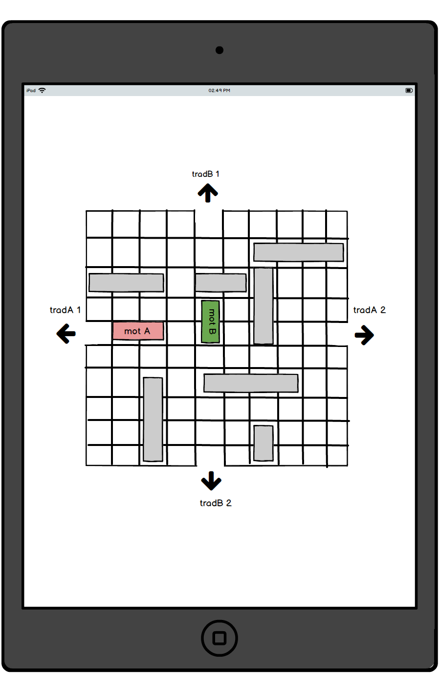

# JAV1 - TrafficJam
## About the project
The game is based on the well known TrafficJam (see picture below) including a vocabulary learning. The purpose of the game is to "lean and play" simultaneously. The project might be included with other games developped by colleagues.

The included vocabulary comes from a web API.

## Environment
### development environment
* Android Studio 2.3.1
* Nexus 5X API 23 (android emulator)

### requirements
* Java Development Kit 7+

## Class design
### class diagram
### sequence diagram